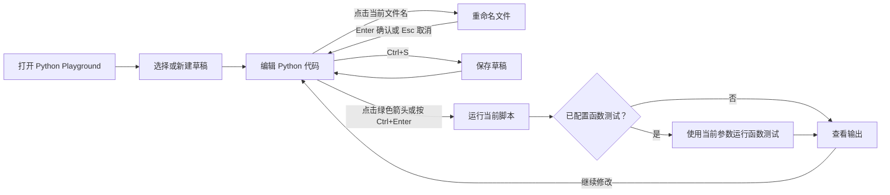

# Python Playground 使用流程

```mermaid
flowchart LR
    A[打开 Python Playground] --> B[选择或新建草稿]
    B --> C[编辑 Python 代码]
    C -->|点击当前文件名| D[重命名文件]
    D -->|Enter 确认或 Esc 取消| C
    C -->|Ctrl+S| E[保存草稿]
    E --> C
    C -->|点击绿色箭头或按 Ctrl+Enter| F[运行当前脚本]
    F --> G{已配置函数测试？}
    G -->|是| H[使用当前参数运行函数测试]
    G -->|否| I[查看输出]
    H --> I
    I -->|继续修改| C
```
